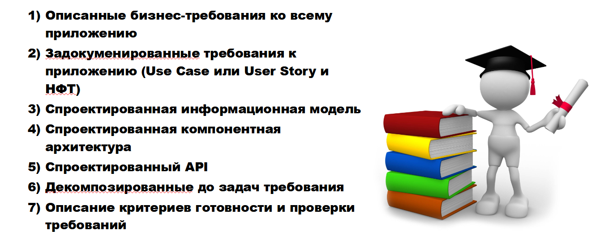
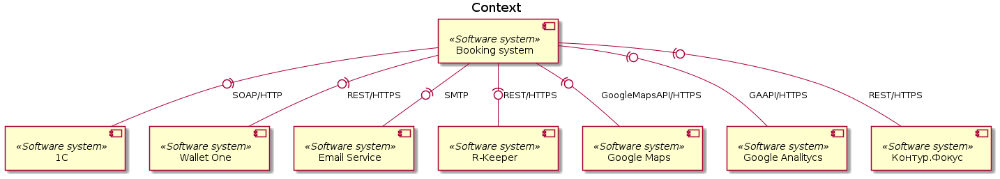

## Оглавление

* [Глоссарий](#глоссарий) раздел пока пуст
* [Бизнес цели](#бизнес-цели) раздел пока пуст
* [Варианты использования](#варианты-использования)
  * [Верхнеуровневая схема](#верхнеуровневая-схема)
  * [Управление ресторанами и оплата услуг](#управление-ресторанами-и-оплата-услугstructureucclient-profilemd) нет текстовой части
  * [Управление ЮЛ в ЛК](#управление-юл-в-лкstructureucmanager-profilemd) нет текстовой части
  * [Бронирование столика](#бронирование-столикаstructureucuser-profilemd) нет текстовой части
  * [Регистрация ЮЛ](#регистрация-юлstructureucclient-registrationmd)
* [Модель предметной области](#модель-предметной-области)
* [Информационная модель](#информационная-модель)
* [Swagger](https://app.swaggerhub.com/apis/indeec05/Booking_system/1.0.0)

## Глоссарий

Личный кабинет (ЛК) - раздел сайта, доступный только авторизированным пользователям и клиетам с соответствующей ролью.

## Бизнес цели

Раздел пока пуст

## Варианты использования

### Верхнеуровневая схема

[Исходник](src/use-case-general.wsd)

### [Управление ресторанами и оплата услуг](structure/uc/client-profile.md)

### [Управление ЮЛ в ЛК](structure/uc/manager-profile.md)

### [Бронирование столика](structure/uc/user-profile.md)

### [Регистрация ЮЛ](structure/uc/client-registration.md)

## Модель предметной области

![erd](https://plantuml.w1.money/png/dLNTIXj15BxVfnXoALNQguA858fl4P1Dkh5BDxkokw584KnKl50QsmeLgJ-rlUZbccGrncnyXPatwZbdPjpPJMAXGipc_7xdc-_ClebYEunRJS-otdfs5B4AF-CFVCXJdebEXTaHgtkkuyViayNWZv_pXD_n7lpFC4eQJy5yBXz_yebeYmxyxveHc3RaOopB9-NqQtXyPFm6lkx0deesJwnjowehH9TY1n87L3U1v25yf_n175LzFihHyeJmDfrcpGartjy0xaAtWIIelWS8CZAjDMtNayvBda2N2LOrMr-JUIZsg3HmvJOQ9XLpP_e1Zna3-mrG0OL5HziJFXBj6PuB_WYDsiKoPn0tHZCuXgAhE2OUCZv0SF2SYKD-lyngGU0vjc_2Bvs6wB8PX844OYTYAojhVglfX7Ri1lxgQZubp8ODvC_lH4ZA-mIgG-JiwF5bo34Cs84UlOAhG2gSjpWidJXXgRKYrtUYQ3tUsfoFwGepQAoTSksIYug63epO2kr_g5Z9S2HsnJxQzJG375YqvSzla8CYGbENePQmcOQLm22Fg2But98meFeogygs57H2xZxb9Izo-n_95bh9MDqkh01a3V3in6Tne0i3rgfFmcZJHe0KcSIQ4w1uhGU-xzIHHKq1GkoZIAVrhnOvfQ8zCDupAALfA92Ta8eFe0x434XMHzJmOn1-SFsDzNVsbkxubOGpHX42B4X29fCftmJ6X0KbVvQB_aGMnzoKEe6C2rB7cKdR8xMhDS_HhS-a2waZSc0eXdJX3sEdGC-x-g3BwsYqEeQ5a0IZVFNgqnOMRoG2ql0qYbCSyF_leYzapCojmaPoRu80wNvsthww35AzooSuyTG9pE73uBTCkugZZPw5KNHDZElglZ7l5_YaUdOGEY767RkLcj8BTW4EUTyQnb-qSwdOr_LI1ADCfRiGxYkn2pMHk163c0U2lqU7EHQ7XDDfRdh1bgF5C_zWr9kcyd9fwLM5BIukg7UbfLwPw5X0noghG81yUynnIbBcE8ktecNSPq-1UUzyqmrddcAPcuaHhwSYvEhCphQqqfwcLX0BXrk8KaKQtfGrT3VUn-2YXfRrHBmvldnKmpqJeTZz2m00 "erd")

[Исходник](src/erd.wsd)

## Информационная модель

### Context

### [Containers](structure/arch/c4-containers.md)
