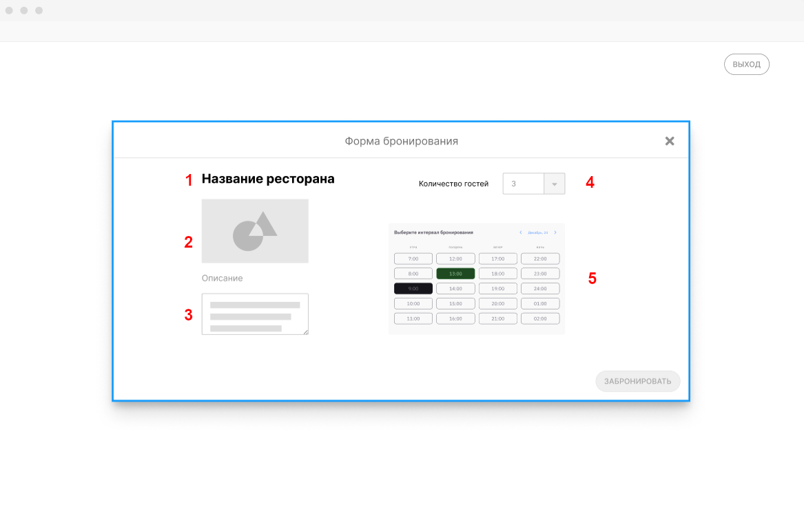

# Как Посетитель я хочу забронировать столик, чтобы принять пищу в подходящем месте в удобное мне время в соответствии с размером компании

## Критерии приемки

* Есть такая страница
* В списке выбора периодов отображается только незанятые
* Столики, доступные для бронирования, фильтруются в зависимости от количества гостей
* После создания бронирования оно создается в системе ресторана (R-Keeper) в выбранное время на нужный столик.
* В информации о бронировании, созданной в системе ресторана, доступны телефон Посетителя, который он указал в Системе, и количество гостей.

## Задачи

* Сделать форму бронирования
* Сделать CRUD методы для бронирований
* Предусмотреть механизм обновлений бронирований

### Сделать форму бронирования

[Исходник](../../../src/Screenshot_132.xcf)

**Описание полей формы**

|Номер поля|Описание|
|----------|--------|
|1|Название того ресторана, в котором бронируем столик|
|2|Превью ресторана|
|3|Описание столика|
|4|Дропдаун с возможностью ввести значение. Только целые числа. До 100. Количество человек в брони|
|5|Элемент формы, позволяющий выбрать временной интервал и дату бронирования. Интервалы измеряются в часах. Должен уметь выделять выбранное время и не давать делать брони на те периоды, на которое они уже есть.|

Список бронирований для столика можно получить методом GET /bookings?tableId={tableId}

Создание бронирования осуществляется вызовом POST /bookings/

**Проверка**

1. форма вызывается с по клику на кнопку "Забронировать" на столике
2. информация на форме соответствует тому ресторану, со страницы которого ее вызвали
3. Регресс

### Сделать CRUD операции для бронирования

_Задача сформулирована в рамках [допущений](../../requirements/assumptions.md)!_

В рамках задачи необходимо сделать CRUD операции для бронирований в соответствии с [описанием](https://app.swaggerhub.com/apis/indeec05/Booking_system/1.0.0?loggedInWithGitHub=true#/%D0%91%D1%80%D0%BE%D0%BD%D0%B8%D1%80%D0%BE%D0%B2%D0%B0%D0%BD%D0%B8%D0%B5%20%D1%81%D1%82%D0%BE%D0%BB%D0%B8%D0%BA%D0%B0/createBooking). Речь идет о методах:

* POST /bookings
* GET /bookings
* GET /bookings/{bookingId}
* DELETE /bookings/{bookingId}
* PATCH /bookings/{bookingId}

В отношении методов POST, DELETE, PATCH необходимо иметь в виду, что все они должны отражаться в системах управления ресторанами. При этом методы POST и PATCH должны отрабатывать синхронно, чтобы исключить возможность коллизий. 

Метод DELETE должен вызвать класс, созданный в задаче [...] для асинхронного обмена.

Пример вызовов для методов POST и PATCH:

[Исходник](../../../src/post-boobking-siquence.wsd)

### Сделать механизм обновления бронирований

В рамках задачи необходимо реализовать синхронизатор бронирований в ресторанах и Системе.

На возможные варианты работы механизма распространяются следующие ограничения:

1. обновления спроавчника, сделанные со стороны ресторана, можно получать только периодическим опросом
2. так как r-keeper достаточно тяжеловесное решение, частота опросов не может быть большой

Предполагается следующая реализзация взаимодействий этого механизма:

[Исходник](../../../src/synchronizer.wsd)