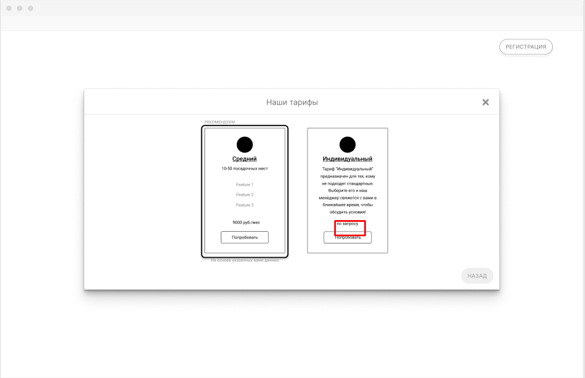
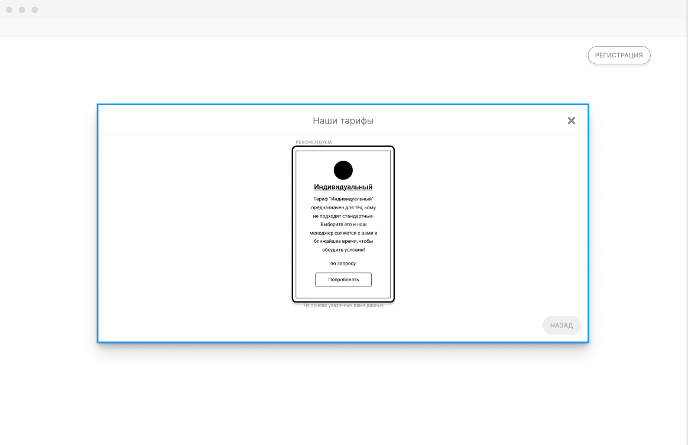

# Я как представитель крупного бизнеса хочу индивидуальные условия, чтобы получить  подходящее мне предложение

## Критерии приемки

* Если в процессе регистрации представитель Клиента указал оборот компании больше 100000 рублей в месяц или количества столиков больше 50, то в списке выбора тарифов остается только один: “Индивидуальные условия”
* После того, как других тарифов не осталось, “Индивидуальные условия” оказывается выбранными по умолчанию
* Представитель Клиента не может убрать выбор тарифа "Индивидуальные условия"

## Задачи

### Добавить тариф “Индивидуальные условия”

Добавить тариф методом POST /tariffs/. Объект:

```json
{
  "name": "Индивидуальные условия",
  "isStandart": true,
  "minTurnover": 0,
  "maxTurnover": 10000000000,
  "description": "Тариф \”Индивидуальные условия\” предназначен для тех, кому не подходят стандартные. Выберите его и наш менеджер свяжется с вами в ближайшее время, чтобы обсудить условия!",
  "commission": 0
}
```

После этого тариф должен появляться в списке GET /tariffs?isstandard=true&tables=10&turnover=1000 при указании любых значений в полях tables (до 100000), turnover (от 0 до 10000000000).

### Выделить индивидуальный тариф на форме выбора тарифов

На шаге выбора тарифа предусмотреть у индивидуального тарифа на форме выбора функцию замены цены на строку “по запросу”.

Относится к веб версии платформы.

Пример интерфейса:



Критерии проверки: регресс.

### Сделать автоматический выбор индивидуального тарифа в случае крупного бизнеса

На шаге выбора тарифа предусмотреть функцию автоматического выделения тарифа в случае, если метод GET /tariffs/ возвращает только один тариф.



Относится к веб-версии.
Критерий приемки: регресс.
