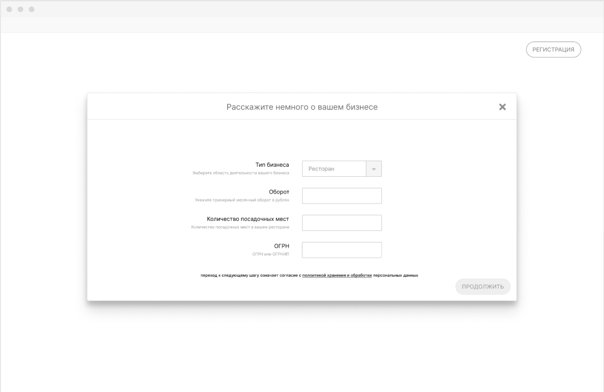
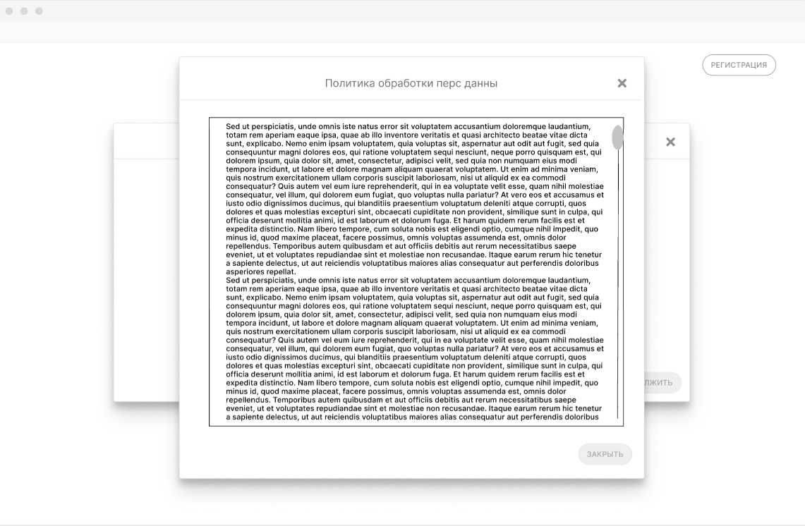

# Я как представитель юр департамента хочу, чтобы клиенты могли ознакомиться с политикой обработки перс данных и подтвердить согласие с ней.

## Критерии приемки

* На форме регистрации на шаге выбора тарифа у представителя Клиента есть возможность ознакомиться с сообщением о том, что переход к дальнейшему шагу означает согласие с политикой обработки перс данных
* У представителя Клиента есть возможность ознакомиться с политикой обработки перс данных, не закрывая форму регистрации
* У представителя Клиента нет возможности перейти к дальнейшему шагу, пропустив шаг выбора тарифа и, соответственно, согласие на обработку перс данных

## Задачи

### Добавить на форму регистрации условия обработки перс данных

На форме регистрации добавить строку под формой ввода данных  о компании: “Переход к следующему шагу означает согласие с политикой хранения и обработки персональных данных”, в которой подстрока “политикой хранения и обработки персональных данных” является активным элементом и подчеркивается как ссылка. По нажатию на нее появляется модальное окно с текстом политики обработки. Текст приложен к задаче.





Критерий проверки: регресс.

### Устанавливать признак согласия обработки перс данных при создании клиента

После прохождения всех шагов формы регистрации вызывает метод POST /clients на бэкенде. В него в задаче *ссылка* добавится новый параметр agreement. Необходимо предусмотреть его установку при создании клиента. Всегда true (означает согласие), так как в противном случае клиент не будет создан.

Критерий проверки: у созданной сущности клиента в БД стоит значение agreement: true.

### Добавить свойство agreement у сущности клиента

Добавить новую колонку в таблице clients. 

```sql
ALTER TABLE clients
ADD agreement BOOLEAN false ;

```

### Добавить поле в методы API

Описание задачи: в методы

* POST /clients
* PUT /clients/{id}

необходимо добавить необязательное свойство agreement с типом boolean. Ссылка на обновленный метод POST для примера: [addClient](https://app.swaggerhub.com/apis/indeec05/Booking_system/1.0.0#/%D0%A3%D0%BF%D1%80%D0%B0%D0%B2%D0%BB%D0%B5%D0%BD%D0%B8%D0%B5%20%D0%BA%D0%BB%D0%B8%D0%B5%D0%BD%D1%82%D0%B0%D0%BC%D0%B8/addClient)

Необходимо также предусмотреть добавление нового свойства в модель ответа методов:

* POST /clients
* PUT /clients/{id}
* GET /clients
* GET /clients/{id}

Критерий проверки:

1. регресс
2. значение agreement в БД у добавляемого клиента меняется на переданное
3. в моделях ответа перечисленных методов новое поле присутствует
