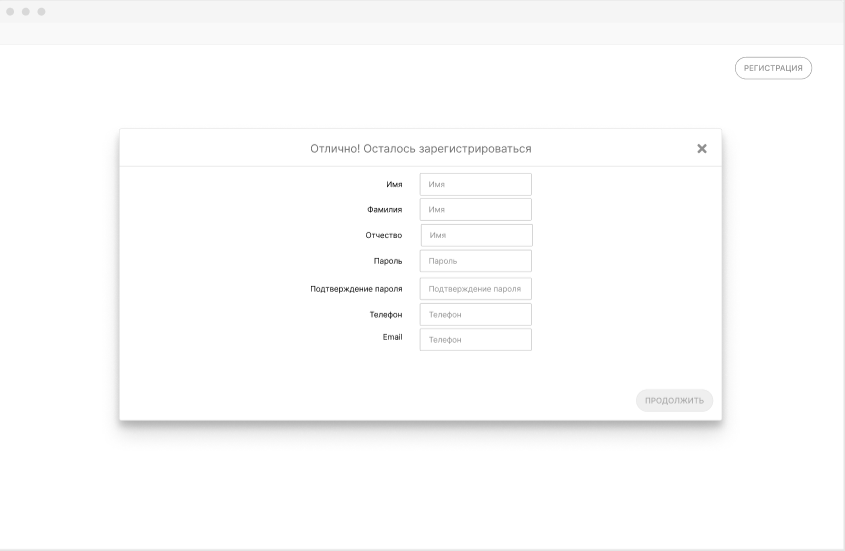

# Я как представитель бизнеса хочу ввести контактные данные, чтобы со мной связались

## Критерии приемки

* Представителю бизнеса доступна элементы ввода контактных данных
* Поля вода email и телефон не дают ввести некорректные данные
* Все из них обязательны

## Задачи

### Добавить шаг ввода контактных данных клиента

На форме регистрации необходимо предусмотреть шаг ввода контактных данных представителя клиента.

Перечень полей:

| Название | Тип    | Обязательность | Label    |
| -------- | ------ | -------------- | -------- |
| Имя      | string | Да             | Имя      |
| Фамилия  | string | Да             | Фамилия  |
| Отчество | string | Нет            | Отчество |
| Телефон  | string | Да             | Телефон  |
| email    | string | Да             | email    |
| Пароль   | string | Да             | Пароль   |

Тип input для ввода пароля =password

Строки в первом и втором полях для пароля должны совпадать.

В случае, если обязательное поле не заполнено, форма должна сообщить об этом присвоением полю тега Warning. 

Критерии проверки:

1. регресс
2. клиент создает
3. форма ведет себя аналогично описанному в задаче образу

### Доработать АПИ для регистрации представителя клиента

Создать необходимый набор конечных точек и пользователя с верным набором прав.

Необходимый набор ресурсов API:

1. [POST /member](https://app.swaggerhub.com/apis/indeec05/Booking_system/1.0.0#/%D0%A3%D0%BF%D1%80%D0%B0%D0%B2%D0%BB%D0%B5%D0%BD%D0%B8%D0%B5%20%D0%BF%D1%80%D0%B5%D0%B4%D1%81%D1%82%D0%B0%D0%B2%D0%B8%D1%82%D0%B5%D0%BB%D1%8F%D0%BC%D0%B8%20%D0%BA%D0%BB%D0%B8%D0%B5%D0%BD%D1%82%D0%B0/addClientMember)
1. [GET /members/{id}](https://app.swaggerhub.com/apis/indeec05/Booking_system/1.0.0#/%D0%A3%D0%BF%D1%80%D0%B0%D0%B2%D0%BB%D0%B5%D0%BD%D0%B8%D0%B5%20%D0%BF%D1%80%D0%B5%D0%B4%D1%81%D1%82%D0%B0%D0%B2%D0%B8%D1%82%D0%B5%D0%BB%D1%8F%D0%BC%D0%B8%20%D0%BA%D0%BB%D0%B8%D0%B5%D0%BD%D1%82%D0%B0/getClientMemberById)
1. [GET /members/{id}](https://app.swaggerhub.com/apis/indeec05/Booking_system/1.0.0#/%D0%A3%D0%BF%D1%80%D0%B0%D0%B2%D0%BB%D0%B5%D0%BD%D0%B8%D0%B5%20%D0%BF%D1%80%D0%B5%D0%B4%D1%81%D1%82%D0%B0%D0%B2%D0%B8%D1%82%D0%B5%D0%BB%D1%8F%D0%BC%D0%B8%20%D0%BA%D0%BB%D0%B8%D0%B5%D0%BD%D1%82%D0%B0/updateClietntMemberById)
1. [DELETE /members/{id}](https://app.swaggerhub.com/apis/indeec05/Booking_system/1.0.0#/%D0%A3%D0%BF%D1%80%D0%B0%D0%B2%D0%BB%D0%B5%D0%BD%D0%B8%D0%B5%20%D0%BF%D1%80%D0%B5%D0%B4%D1%81%D1%82%D0%B0%D0%B2%D0%B8%D1%82%D0%B5%D0%BB%D1%8F%D0%BC%D0%B8%20%D0%BA%D0%BB%D0%B8%D0%B5%D0%BD%D1%82%D0%B0/deleteClientMemberById)

В рамках задачи необходимо также реализовать обработку CRUD методов. Создавать пользователя с записью в таблице members, удалять, редактировать, получать сохраненные значения.

### Создавать представителя при регистрации клиента

После завершения формы регистрации клиента необходимо также вызывать метод POST /members. [Описание метода](https://app.swaggerhub.com/apis/indeec05/Booking_system/1.0.0#/%D0%A3%D0%BF%D1%80%D0%B0%D0%B2%D0%BB%D0%B5%D0%BD%D0%B8%D0%B5%20%D0%BF%D1%80%D0%B5%D0%B4%D1%81%D1%82%D0%B0%D0%B2%D0%B8%D1%82%D0%B5%D0%BB%D1%8F%D0%BC%D0%B8%20%D0%BA%D0%BB%D0%B8%D0%B5%D0%BD%D1%82%D0%B0/addClientMember)

Последовательность вызовов:

[Источник](../../../src/client-with-member-creation.wsd)

Критерии приемки:
1. представитель создается вместе с клиентом из формы регистрации
