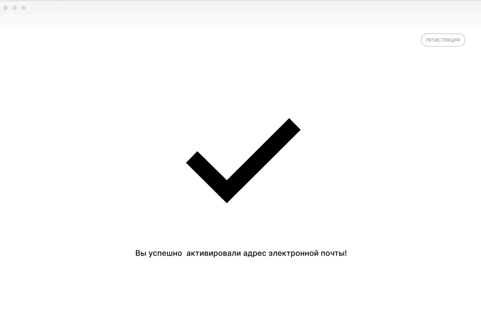

# Я как представитель бизнеса хочу подтвердить свой почтовый адрес, чтобы данные о моей организации приходили только мне

## Критерии приемки

* После завершения представителем шага ввода контактных данных и информации о бизнесе на указанную им почту отправляется письмо с просьбой подтвердить регистрацию и ссылкой подтверждения
* У сущности клиента появляется дополнительный статус, означающий, что клиент зарегистрирован, но почта не подтверждена
* После перехода по ссылке из письма статус клиента меняется на означающий подтверждение почты
* Информация о статусах отображается у сущности клиента в ЛК менеджера
* После 24 часов время жизни токена истекает

## Задачи

### Сделать генерацию ссылок для подтверждения.

В рамках задачи необходимо сделать класс, генерирующий ссылку для подтверждения email. Формат ссылки - auth_url?confirm=BAB3894904898A8CBAB3894904898A8C23898347498347899323928834AEFAA, где в auth url будет ссылаться на контроллер, созданный в рамках задачи [...], а confirm - параметр, в значении которого 64 битный хэш. Хэш должен быть сохранен в БД в таблице. У хэша есть свой жизненный цикл:

```plantuml

[*] --> New
New --> Confirmed : был переход по ссылке
New --> Expired : время жизни хэша закончилось
Expired --> [*]
Confirmed --> [*]

```

Таблица для хранения хэшей:

|Колонка|Формат|Уникальный|
|-------|------|----------|
|hash|varchar(64)|v|
|state|varchar(9)||
|date_create|datetime||
|user_id|string(uuid)||

Критерии проверки: регресс

### Сделать контроллер для подтверждения email

Необходимо сделать контроллер, который будет иметь опубликованный урл auth_url. После перехода на этот урл необходимо:

1. достать хэш из параметра confirm
2. достать из БД объект хэша
3. сравнить дату с текущей. Если разница больше 24 часов, присвоить хэшу статус Expired и показать пользователю на страницу неуспеха
4. Если разница меньше 24 часов, присвоить аккаунту нужный статус, хэшу статус Confirmed и показать пользователю на страницу успешной активации

Критерии проверки: регресс

### Сделать страницы успешного и неуспешного подтверждения email

Для подтверждения email необходимо сверстать две страницы:

* страницу успешного подтверждения
* страницу неуспешного подтверждения

Пример такой страницы:



Для страницы с неуспешным подтверждением email текст должен быть: "Кто-то облажался..." и символ должен означать неуспех.

### Сделать отправку письма со ссылкой на подтверждение email

После регистрации нового клиента на указанный в форме адрес должно отправляться письмо со следующим текстом:

"Хей бро!

ПОдтверди регистрацию, йо!

Вот тебе ссылка, маза фака: [ссылка генерируется в задаче [...]]

А не то получишь по яйцам (или по титькам)!

Но так-то мы и обознаться могли, за что вы нас извините, пожалуйста."
