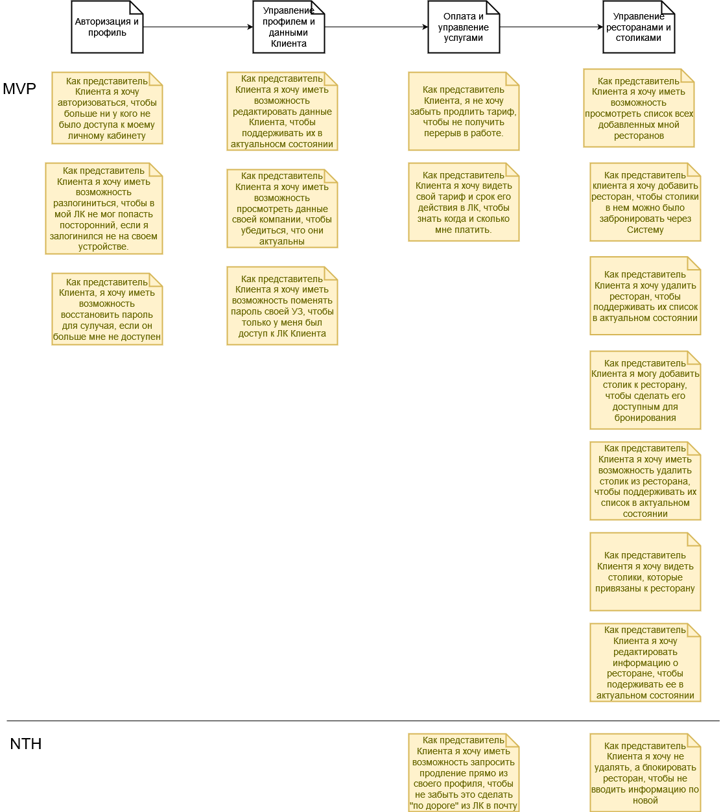

## Личный кабинет клиента

[Исходник](../../src/uc-member-lk.drawio)

1. Как представитель Клиента я хочу авторизоваться, чтобы больше ни у кого не было доступа к моему личному кабинету

* Есть форма, на которой можно ввести данные, чтобы авторизоваться
* Без авторизации невозможно попасть в приложение/ЛК Клиента на сайте

2. Как представитель Клиента я хочу иметь возможность разлогиниться, чтобы в мой ЛК не мог попасть посторонний, если я залогинился не на своем устройстве.

* Если пользователь был авторизован, в ЛК Клиента на всех страницах должна быть доступна кнопка прекращения авторизации, по нажатию на которую пользователь разлогинится
* После разлогинивания доступ к ЛК Клиента прекращается. При попытке открыть страницу ЛК выводится требование авторизации

3. Как представитель Клиента, я хочу иметь возможность восстановить пароль для случая, если он больше мне не доступен.

* Есть форма, на которой можно ввести данные, чтобы восстановить пароль
* Есть подтверждение того, что представитель Клиента действительно является владельцем УЗ через отправку письма на email со ссылкой на смену пароля
* После перехода по ссылке представитель Клиента может указать новый пароль
* После изменения пароля вход в приложение возможен только с новым паролем
* Представитель Клиента не может поменять пароль, если неправильно ввел подтверждение
* Представитель Клиента не может войти со старым паролем, если установил новый

4. Как представитель Клиента я хочу иметь возможность редактировать данные Клиента, чтобы поддерживать их в актуальном состоянии

* На странице просмотра данных компании есть возможность отредактировать эти данные
* Новые значения сохраняются в Системе
* представитель Клиента не может сохранить отредактированные данные, если не заполнены обязательные поля: ИНН, телефон, email
* Представитель Клиента не может сохранить отредактированные данные, если в полях ИНН, телефон, email указаны значения, не подходящие под формат

5. Как представитель Клиента я хочу иметь возможность просмотреть данные своей компании, чтобы убедиться, что они актуальны

* Есть страница, на которой выводятся данные Клиента и представителя Клиента, сохраненные в Системе

6. Как представитель Клиента я хочу иметь возможность поменять пароль своей УЗ, чтобы только у меня был доступ к ЛК Клиента

* На странице просмотра данных УЗ есть возможность изменить пароль
* Есть подтверждение того, что представитель Клиента действительно является владельцем УЗ через отправку письма на email со ссылкой на смену пароля
* После перехода по ссылке представитель Клиента может указать новый пароль
* После изменения пароля вход в приложение возможен только с новым паролем
* Представитель Клиента не может поменять пароль, если неправильно ввел подтверждение
* Представитель Клиента не может войти со старым паролем, если установил новый

7. Как представитель Клиента я хочу видеть свой тариф и срок его действия в ЛК, чтобы знать когда и сколько мне платить.

* Представитель клиента в профиле клиента видит название тарифа, сумму платежа и дату окончания оплаченного периода

8. Как представитель Клиента я хочу иметь возможность запросить продление прямо из своего профиля, чтобы не забыть это сделать "по дороге" из ЛК в почту

* Представитель Клиента при просмотре тарифа в ЛК видит предложение о продлении оплаченного периода действия тарифа
* При нажатии на кнопку запроса счета закрепленного за Клиентом менеджеру уходит письмо с запросом на продление счета, чтобы менеджер мог это сделать
* В письме указано название Клиента, чтобы менеджер его не искал
* Представитель Клиента не может отправить запрос больше одного раза в сутки

9. Как представитель Клиента, я не хочу забыть продлить тариф, чтобы не получить перерыв в работе.

* За две недели до окончания срока действия тарифа представителю Клиента на почту приходит письмо с напоминанием о необходимости продления
* В письме указаны оставшийся срок действия, адрес почты менеджера и сообщение о том, что если последний не связался, то лучше написать ему самому
* В reply to письма стоит почта менеджера

10. Как представитель Клиента я хочу иметь возможность просмотреть список всех добавленных мной ресторанов

* Представитель Клиента на списке ресторанов видит только добавленные им
* При просмотре списка представитель Клиента видит с каждой строчки списка имеет возможность перейти к соответствующему элементу (ресторану)

11. Как представитель клиента я хочу добавить ресторан, чтобы столики в нем можно было забронировать через Систему

* На списке ресторанов представитель Клиента может перейти к форме добавления ресторана
* На странице добавления ресторана есть все необходимые поля (...)
* Представитель Клиента получает ошибку при попытке добавить ресторан с незаполненными обязательными полями
* Представитель Клиента не может добавить ресторан с дублирующимся значением в поле адрес

12. Как представитель Клиента я хочу удалить ресторан, чтобы поддерживать их список в актуальном состоянии

* При просмотре отдельного ресторана представителем Клиента ресторана есть возможность удалить ресторан
* В случае наличия активных броней при удалении ресторана представителем Клиента Посетителям отправляются соответствующие уведомления
* В случае удаления ресторана представителем Клиента удаляются и все относящиеся к нему столики
* В случае удаления ресторана представителем Клиента пропадает возможность бронировать в нем столики
* Представитель Клиента не может удалить ресторан без подтверждения

13. Как представитель Клиента я хочу не удалять, а блокировать ресторан, чтобы не вводить информацию по новой

14. Как представитель Клиента я хочу редактировать информацию о ресторане, чтобы поддерживать ее в актуальном состоянии

* На странице просмотра ресторана представителем Клиента есть кнопка редактирования информации
* Кнопка дает отредактировать информацию
* Представитель Клиента не может сохранить отредактированную информацию, если не заполнено поле адрес или название ресторана

15. Как представитель Клиента я хочу видеть столики, которые привязаны к ресторану

* На странице информации о ресторане представителю Клиента доступен список привязанных к нему столиков

16. Как представитель Клиента я могу добавить столик к ресторану, чтобы сделать его доступным для бронирования

* На странице просмотра деталей о ресторане представителю Клиента доступна кнопка добавления столика
* Кнопка открывает форму добавления столика
* Представитель Клиента не может добавить столик, не заполнив все обязательные поля
* Представитель клиента получает ошибку привязки столика в Системе к столику в ресторане, если привязка с этим столиком в ресторане уже есть

17. Как представитель Клиента я хочу иметь возможность удалить столик из ресторана, чтобы поддерживать их список в актуальном состоянии

* На странице просмотра ресторана представителю Клиента доступна возможность удалить столик
* Представитель Клиента не может удалить столик без подтверждения
