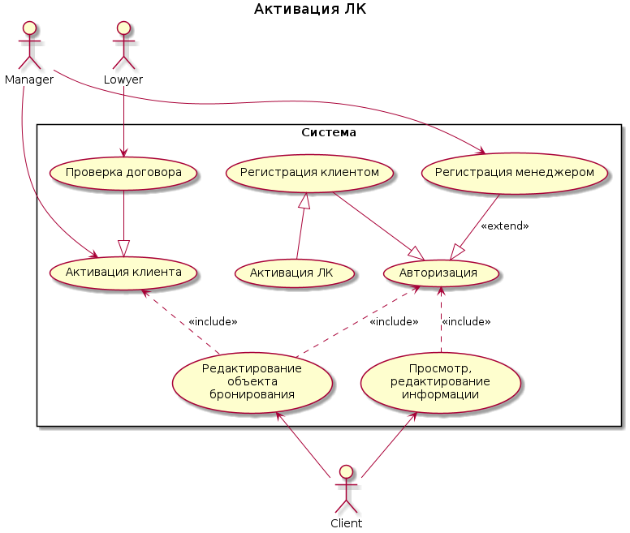

# Регистрация клиентом

Самостоятельная регистрация клиентом-представителем ЮЛ в сервисе.

## Субъекты

* представитель ЮЛ

## Поток событий

1. Клиент заходит на страницу регистрации
2. Система отображает форму выбора типа бизнеса
3. Клиент выбирает свой тип бизнеса
4. Система отображает форму выбора тарифа
5. Клиент выбирает тариф
6. Система отображает форму ввода контактных данных
7. Клиент вводит контактные данные
8. Клиент подтверждает регистрацию
    1. Альтернативный сценарий: регистрация менеджером

## Постусловия

Клиент зарегистрирован в системе. Личный кабинет не активирован

# Активация личного кабинета

Активация клиентом своего личного кабинета

## Субъекты

* представитель ЮЛ

## Поток событий

1. Клиент переходит по ссылке для активации личного кабинета
2. Система активирует личный кабинет

## Предусловия

* Клиент получил письмо со ссылкой для активации

## Постусловия

* Личный кабинет клиента активирован.
* Клиенту доступны просмотр, редактирование информации и активация объекта недвижимости

# Авторизация

Авторизация клиента в своем личном кабинете

## Субъекты

* представитель ЮЛ

## Поток событий

1. Клиент заходит на страницу авторизации
2. Система отображает форму авторизации
3. Клиент вводит авторизационные данные
4. Система авторизует клиента
5. Система перенаправляет клиента на основную страницу его личного кабинета

## Альтернативный поток 1

1. Система не авторизует клиента, так как введены неправильные авторизационные данные
2. Система отображает клиенту информацию о том, что введены неправильные авторизационные данные и дает клиенту возможность ввести их повторно
3. В случае трех неуспешных попыток система блокирует возможность авторизации для этого клиента (логина) на 5 минут

## Постусловия

* Клиент авторизован в системе

# Регистрация менеджером

Регистрация клиента менеджером

## Субъекты

* представитель ЮЛ
* менеджер

## Поток событий

* Менеджер звонит клиенту 
* Менеджер предлагает клиенту наши услуги по сценарию звонка
* Менеджер проводит регистрацию клиента

## Предусловия

* Либо клиент оставил свои контактные данные на форме регистрации, но не завершил ее
* Либо менеджер получил контактные данные клиента каким-то другим образом

## Постусловия

* Клиент зарегистрирован в системе
* На почту клиента отправлено письмо активации

# Активация клиента

Активация менеджером клиента

## Субъекты

* представитель ЮЛ (представитель клиента)
* менеджер

## Поток событий

* менеджер переходит по ссылки из письма о регистрации нового клиента
* система отображает страницу клиента
* менеджер проверяет данные клиента по соответствующим бизнес-правилам
* менеджер осуществляет подбор тарифа на основании данных клиента
* менеджер согласует тариф с клиентом
* менеджер передает данные клиента юристу для подготовки договора
* после подготовки договора менеджер передает его представителю ЮЛ для подписания
* клиент подписывает договор
* клиент отправляет подписанный договор менеджеру
* менеджер передает подписанный договор в бухгалтерию
* менеджер активирует клиента

## Предусловия

* менеджеру пришло письмо о регистрации нового клиента

## Постусловия

* клиент активирован и может работать в приложении.
