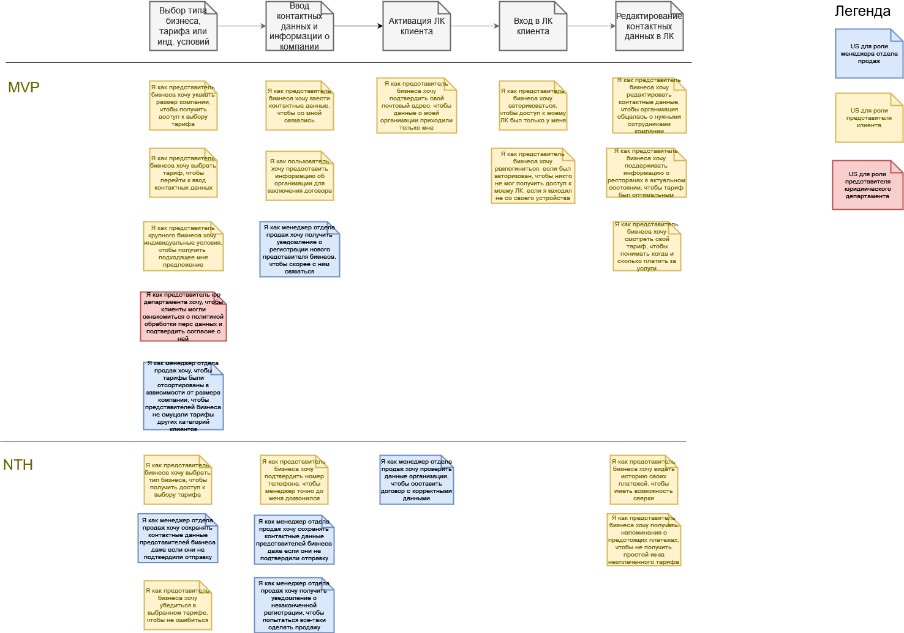

[Исходник](../../src/us-registration.drawio)

## Пользовательские истории

1. Я как представитель бизнеса хочу выбрать тип бизнеса, чтобы получить доступ к выбору тарифа.

* На форме регистрации присутствует элемент выбора типа бизнеса
* Элемент дает возможность выбрать один из списка типов бизнеса, утвержденных нашей организацией

2. Я как представитель бизнеса хочу указать размер компании, чтобы получить доступ к выбору тарифа

* На форме регистрации присутствует элемент указания ежемесячного оборота компании
* На форме регистрации присутствует элемент указания количества столиков

3. Я как представитель бизнеса хочу выбрать тариф, чтобы перейти к вводу контактных данных

* На форме регистрации присутствует элемент выбора тарифа
* Присутствует возможность выбора одного из тарифов

4. Я как менеджер отдела продаж хочу, чтобы тарифы показывались в зависимости от размера компании, чтобы представителей бизнеса не смущали тарифы других категорий клиентов

* В элементе выбора тарифа доступны только те, которые релевантны компаниям соответствующего диапазона оборота и количества столиков, и тариф “Индивидуальные условия”
* У тарифов есть возможность указания, к какому обороту компании и диапазону количества столиков они относятся

5. Я как представитель крупного бизнеса хочу индивидуальные условия, чтобы получить  подходящее мне предложение

* При указании оборота компании больше 100000 рублей в месяц или количества столиков больше 50 в списке выбора тарифов остается только один: тариф “Индивидуальные условия”
* Представитель крупного бизнеса может выбрать тариф “Индивидуальные условия”

6. Я как представитель юр департамента хочу, чтобы клиенты могли ознакомиться с политикой обработки перс данных и подтвердить согласие с ней

* На форме регистрации на странице выбора тарифа есть возможность ознакомиться с сообщением о том, что переход к дальнейшему шагу означает согласие с политикой обработки перс данных
* У представителя бизнеса есть возможность ознакомиться с политикой обработки перс данных, не закрывая форму регистрации

7. Я как представитель бизнеса хочу убедиться в выбранном тарифе, чтобы не ошибиться

* При переходе к шагу ввода контактных данных представителю бизнеса отображается сообщение о согласии с выбранным тарифом
* В случае согласия представитель бизнеса переходит к шагу ввода контактных данных. В случае отказа - остается на шаге выбора тарифа

8. Я как представитель бизнеса хочу ввести контактные данные, чтобы со мной связались

* Представителю бизнеса доступна элементы ввода контактных данных
* Поля вода email и телефон не дают ввести некорректные данные
* Все из них обязательны

9. Я как пользователь хочу предоставить информацию об организации для заключения договора

* Представителю бизнеса доступны элементы для ввода информации об организации
* Введенных контактных должно быть достаточно для заключения договора, поэтому все поля обязательны

10. Я как менеджер отдела продаж хочу получить уведомление о регистрации нового представителя бизнеса, чтобы скорее с ним связаться

* Менеджеру на электронную почту приходит уведомление о регистрации нового клиента нажатия кнопки “Завершить регистрацию” представителем бизнеса
* В письме есть ссылка на переход в ЛК менеджера на страницу с просмотром данных клиента
* В ЛК менеджера появляется запись о новом клиенте в соответствующем статусе и со всей введенной представителем бизнеса информацией

11. Я как менеджер отдела продаж хочу получить уведомление о незаконченной регистрации, чтобы попытаться все-таки сделать продажу

* Менеджеру на электронную почту приходит письмо о незавершенной регистрации клиента в случае, если представитель бизнеса указал телефон или email, но не завершил регистрацию
* В письме есть контактные данные не завершившего регистрацию клиента

12. Я как представитель бизнеса хочу подтвердить номер телефона, чтобы менеджер точно до меня дозвонился

* До подтверждения телефона представителем бизнеса в ЛК менеджера он отображается как неподтвержденный
* После завершения шага ввода данных и информации о компании представителю клиента отправляется смс с четырехзначным числовым кодом и отображается форма ввода числового кода
* После ввода числового кода, если он верный, телефон в ЛК менеджера отображается как подтвержденный

13. Я как менеджер отдела продаж хочу сохранять контактные данные представителей бизнеса даже если они не подтвердили отправку

* Контактные данные представителя бизнеса сохраняются в БД сразу после увода признака активности с элемента ввода контактных данных
* Сохраненные контактные данные доступны для просмотра из ЛК менеджера

14. Я как менеджер отдела продаж хочу проверить данные организации, чтобы составить договор с корректными данными

* Данные зарегистрировавшегося бизнеса доступны менеджеру отдела продаж в соответствующем разделе ЛК

15. Я как представитель бизнеса хочу подтвердить свой почтовый адрес, чтобы данные о моей организации приходили только мне

* После завершения представителем шага ввода контактных данных и информации о бизнесе на указанную им почту отправляется письмо с просьбой подтвердить регистрацию и ссылкой подтверждения
* У сущности клиента появляется дополнительный статус, означающий, что клиент зарегистрирован, но не почта подтверждена
* После перехода по ссылке из письма статус клиента меняется на означающий подтверждение почты
* Информация о статусах отображается у сущности клиента в ЛК менеджера

16. Я как представитель бизнеса хочу авторизоваться, чтобы доступ к моему ЛК был только у меня

* Доступ к ЛК представителя клиента доступен только после ввода авторизационных данных
* Представителю клиента доступна форма ввода авторизационных данных
* Форма ввода авторизационных данных доступна с любой страницы сайта, если представитель клиента еще не авторизован
  
17. Я как представитель бизнеса хочу редактировать контактные данные, чтобы организация общалась с нужными сотрудниками компании

* В ЛК бизнеса отображаются все его контактные данные
* Доступна возможность ввода нового значения в соответствующих полях
* Если изменен email и он должен подтверждаться, то на него отправляется письмо с ссылкой на подтверждение, по переходу по которой статус подтверждения email меняется
* Если изменен телефон и он должен подтверждаться, то до на него отправляется смс с кодом и представителю клиента доступна возможность указать код в ЛК
* До подтверждения активной остается контактная информация, действовавшая до смены

18. Я как представитель бизнеса хочу поддерживать информацию о ресторанах в актуальном состоянии, чтобы тариф был оптимальным

* В ЛК бизнеса доступна возможность редактирования информации о ресторанах и столиках
* В случае редактирования этой информации менеджеру уходит сообщение о необходимости пересмотра тарифа у этого клиента

19. Я как представитель бизнеса хочу смотреть свой тариф, чтобы понимать когда и сколько платить за услуги

* В ЛК бизнеса доступно описание тарифа
* В описании тарифа есть информация о дате и сумме следующего платежа

20. Я как представитель бизнеса хочу разлогиниться, если был авторизован, чтобы никто не мог получить доступ к моему ЛК, если я заходил не со своего устройства

* В ЛК бизнеса на всех страницах должна быть доступна кнопка прекращения авторизации, если пользователь был авторизован
* По нажатию на кнопку авторизованный представитель разлогинивается, доступ к ЛК становится невозможным.