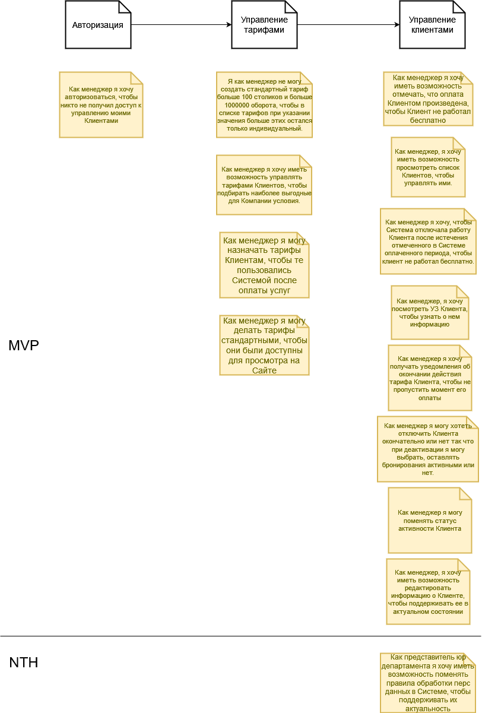

## Личный кабинет менеджера

[Исходник](../../src/us-client-lk.drawio)

18. Как менеджер я хочу иметь возможность отмечать, что оплата Клиентом произведена, чтобы Клиент не работал бесплатно.

* Поскольку я, как менеджер, должен следить за тем, чтобы клиенты не работали бесплатно, я могу указать оплаченный клиентом период, в течение которого он сможет пользоваться Системой.
* Поскольку я, как менеджер, должен следить за тем, чтобы клиенты не работали бесплатно, я могу изменять оплаченный клиентом период, в течение которого он сможет пользоваться Системой.

19. Я как менеджер не могу создать стандартный тариф больше 100 столиков и больше 1000000 оборота, чтобы в списке тарифов при указании значения больше этих остался только индивидуальный.

* Поскольку я, как менеджер, не хочу, чтобы в списке тарифов для крупных клиентов было больше одного индивидуального тарифа, Система не дает создать тариф со значениями выше указанных.

|Критерий размера|Максимальный стандартный тариф|Потолок индивидуального|
|----------------|------------------------------|-----------------------|
|Столики|100|

20. Как представитель юр департамента я хочу иметь возможность поменять правила обработки перс данных в Системе, чтобы поддерживать их актуальность

* это бэклог. AC не будет

21. Как менеджер я хочу иметь возможность управлять тарифами Клиентов, чтобы подбирать наиболее выгодные для Компании условия.

* Поскольку я, как менеджер, должен управлять тарифами, я могу посмотреть их список, чтобы знать, какие из них есть.
* Поскольку я, как менеджер, должен управлять тарифами, я могу завести новый тариф, удалить старый или отредактировать имеющийся, чтобы поддерживать тарифы в актуальном состоянии.

22. Как менеджер я хочу получать уведомления об окончании действия тарифа Клиента, чтобы не пропустить момент его оплаты

* Поскольку я, как менеджер, должен готовить счета, я получаю на почту уведомления об окончании оплаченного Клиентом периода в Системе.
* Поскольку я, как менеджер, не хочу получить перерыва в работе Клиента, чтобы последний не испытывал недовольства, я получаю уведомление за две недели да конца оплаченного периода.
* Поскольку я, как менеджер, могу пропустить письмо, я получаю еще одно уведомление за неделю до конца срока действия оплаченного периода.

23. Как менеджер я хочу, чтобы Система отключала работу Клиента после истечения отмеченного в Системе оплаченного периода, чтобы клиент не работал бесплатно.

* Поскольку я, как менеджер, не хочу, чтобы клиент работал бесплатно, Система делает неактивной учетную запись Клиента на следующий день после окончания оплаченного периода.
* Поскольку я, как менеджер, не хочу, чтобы Посетители испытывали неудобство с уже забронированными столиками, отключение Клиента не ведет к тому, что активные бронирования пропадают из Приложений Посетителей.

24. Как менеджер, я хочу иметь возможность просмотреть список Клиентов, чтобы управлять ими.

* Поскольку я, как менеджер, хочу выбрать клиента для управления им, я вижу список всех клиентов системы
* Поскольку я, как менеджер, хочу иметь возможность быстрого поиска Клиента по названию встроенными средствами браузера, я вижу их всех на одной странице
* Поскольку я, как менеджер, хочу перейти в УЗ Клиента, я могу сделать это из списка Клиентов

25. Как менеджер, я хочу посмотреть УЗ Клиента, чтобы узнать о нем информацию

* Поскольку я, как менеджер, не хочу искать информацию из профиля клиента, она вся сосредоточена на одной странице

26. Как менеджер, я хочу иметь возможность редактировать информацию о Клиенте, чтобы поддерживать ее в актуальном состоянии

* Как менеджер я хочу уточнить информацию о клиенте, поэтому могу отредактировать

27. Как менеджер я могу поменять статус активности Клиента

* Как менеджер я могу поменять статус активности Клиента, чтобы поддерживать его в актуальном состоянии
* Как менеджер я не хочу перевести Клиента в неправильный статус, поэтому могу только сделать его активным или неактивным

28. Как менеджер я могу хотеть отключить Клиента окончательно или нет так что при деактивации я могу выбрать, оставлять бронирования активными или нет.

* Как менеджер при деактивации Клиента в ЛК менеджера я получаю запрос, оставить активными бронирования или нет.

29. Как менеджер я хочу авторизоваться, чтобы никто не получил доступ к управлению моими Клиентами

* Как пользователь при попытке зайти в ЛК менеджера я получаю запрос авторизации
* Как пользователь я не могу авторизоваться в Системе без указания валидных авторизационных данных

30. Как менеджер я могу назначать тарифы Клиентам, чтобы те пользовались Системой после оплаты услуг

* Поскольку я, как менеджер, должен четко следить за оплатой, я могу назначить Клиенту только один тариф
* Поскольку я, как менеджер, не хочу, чтобы Клиенты работали бесплатно, столики Клиента не могут участвовать в бронировании, пока Клиенту не назначен ни одни тариф

31. Как менеджер я могу делать тарифы стандартными, чтобы они были доступны для просмотра на Сайте

* Поскольку я как менеджер хочу, чтобы ценовая политика была прозрачной, я могу сделать тариф стандартным
* Поскольку я как менеджер хочу, чтобы ценовая политика была прозрачной, стандартные тарифы отображаются на Сайте
* поскольку я как менеджер хочу назначать некоторым клиентам индивидуальные тарифы, я могу завести тариф без признака стандартного
