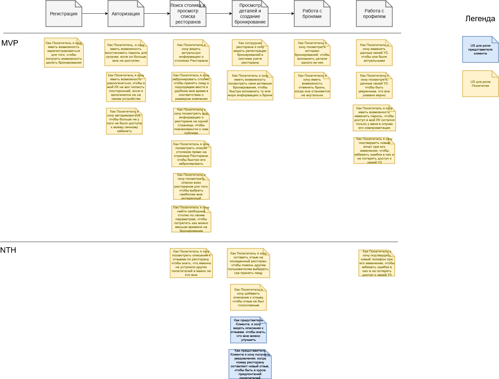

## Личный кабинет менеджера

[Исходник](../../src/US-user-profile.drawio)

## Пользовательские истории

32. Как Посетитель я хочу авторизоваться, чтобы больше ни у кого не было доступа к моему личному кабинету

* Есть форма авторизации
* Без авторизации невозможно попасть в приложение/ЛК Посетителя на сайте
* Невозможно авторизоваться введя только email или пароль
* Авторизация Посетителя возможна только с сохраненными в системе email и паролем

33. Как Посетитель я хочу иметь возможность разлогиниться, чтобы в мой ЛК не мог попасть посторонний, если я залогинился не на своем устройстве.

* В ЛК Посетителя на всех страницах должна быть доступна кнопка прекращения авторизации, если пользователь был авторизован
* По нажатию на кнопку авторизованный представитель разлогинивается, доступ к ЛК становится невозможным
* После того, как пользователь разлогинился, кнопка становится недоступной

34. Как Посетитель я хочу иметь возможность зарегистрироваться для того, чтобы получить возможность делать бронирования.

* Есть форма регистрации
* После заполнения формы регистрации создается УЗ пользователя
* Пользователь может авторизоваться в Системе с учетными данными, введенными на форме регистрации
* Посетитель не может зарегистрироваться, не введя обязательные email и пароль
* Посетитель не может зарегистрироваться, если email или пароль введены не по формату

35. Как Посетитель, я хочу иметь возможность восстановить пароль для случая, если он больше мне не доступен.

* Есть форма восстановления пароля
* Есть подтверждение того, что Посетитель действительно является владельцем УЗ через отправку письма на email со ссылкой на смену пароля
* После перехода по ссылке Посетитель может указать новый пароль
* После изменения пароля вход в приложение возможен только с новым паролем
* Не указав новый пароль на форме, невозможно его поменять
* Только введя подтверждение можно сохранить новый пароль в Системе

36. Как Посетитель я хочу найти свободный столик по своим параметрам, чтобы потратить как можно меньше времени на бронирование.

* Есть список не забронированных в данный момент столиков, по умолчанию отфильтрованный по рейтингу ресторана (убывание), дальности от Посетителя (возрастание).
* Есть возможность отфильтровать столики по количеству мест
* Есть возможность отфильтровать столики по типу кухни ресторана
* Есть возможность перейти к бронированию столика.

37. Как Посетитель я хочу посмотреть список всех ресторанов для того, чтобы выбрать наиболее мне интересный.

* Есть список ресторанов
* В каждом элементе списка доступна информация: кухня, рейтинг, адрес, превью фотографии
* Есть возможность перейти к странице ресторана
* Есть возможность отфильтровать список по: рейтингу ресторана, удаленности, наличию свободных столиков в данный момент, кухне, количеству персон

38. Как Посетитель я хочу посмотреть всю информацию о ресторане на одной странице, чтобы познакомиться с ним поближе

* Есть такая страница
* На странице доступно: описание ресторана, его рейтинг в Системе, загруженные фотографии, тип кухни, список столиков

39. Как Посетитель я хочу забронировать столик, чтобы принять пищу в подходящем месте в удобное мне время в соответствии с размером компании

* Есть такая страница
* Есть возможность выбрать время бронирования
* Есть возможность указать количество гостей
* После создания бронирования оно создается в системе ресторана (R-Keeper) в выбранное время на нужный столик. 
* В информации о бронировании доступны телефон Посетителя, который он указал в Системе, и количество гостей.

40. Как сотрудник ресторана я хочу видеть регистрации бронирований в системе учета ресторана

* После создания бронирования в Системе оно создается в системе учета ресторана (R-Keeper) в выбранное время на нужный столик. 
* В информации о бронировании доступны телефон Посетителя, который он указал в Системе, и количество гостей.

41. Как Посетитель я хочу посмотреть список столиков прямо на странице Ресторана, чтобы быстро его забронировать

* Есть такой список
* В описании столика в списке отображается количество гостей, которые могут за ним разместиться, и его описание
* Есть возможность перейти к бронированию столика прямо со страницы ресторана из списка столиков

42. Как Посетитель я хочу иметь возможность посмотреть свои активные бронирования, чтобы быстро вспомнить ту или иную информацию о брони

* Есть возможность перейти к активной брони с любой страницы приложения
* После перехода открывается страница просмотра этого бронирования

43. Как Посетитель я хочу посмотреть историю бронирований, чтобы вспомнить детали одного из них.

* Есть эта страница
* Бронирования на странице собраны в группы по датам
* У каждого бронирования указан ресторан и превью этого ресторана

44. Как Посетитель я хочу оставить отзыв на посещенный ресторан, чтобы помочь другим пользователям выбирать, где принять пищу.

* На странице бронирования, находящегося в статусе "Успех", доступна кнопка оценки ресторана
* При нажатии на кнопку появляется форма с выбором оценки
* Оценку можно произвести только один раз
* Смена оценки возможна

45. Как Посетитель я хочу добавить описание к отзыву, чтобы отзыв не был голословным.

* На форме оценки есть текстовое поле, в которое можно ввести описание
* Описание сохраняется с привязкой к ресторану

46. Как Посетитель я хочу посмотреть описания к отзывам по ресторану, чтобы знать, что именно не устроило других посетителей и важно ли это мне.

* На странице ресторана есть страница с историей его оценок и описанием к каждой

47. Как представитель Клиента, я хочу видеть описания к отзывам, чтобы знать, что мне можно улучшить.

* На странице ресторана есть страница с историей его оценок и описанием к каждой

48. Как Посетитель я хочу посмотреть данные своей УЗ, чтобы быть уверенным, что все указано верно.

* Есть страница просмотра данных УЗ (имя, телефон, email)

49. Как Посетитель я хочу изменить данные своей УЗ, чтобы они были актуальными.

* На странице просмотра данных есть возможность их изменить
* Изменение данных в приложении приводит к изменению этих данных в БД

50. Как Посетитель я хочу подтвердить новый телефон при его изменении, чтобы избежать ошибки в них и не потерять доступ к своей УЗ.

* При изменении телефона на указанный Посетителем номер отправляется СМС с кодом
* Приложение отображает Посетителю поле для ввода кода
* После ввода Посетителем правильного кода телефон обновляется в УЗ
* До тех пор, пока Посетитель не подтвердил новый телефон, продолжает действовать старый

51. Как Посетитель я хочу подтвердить новый email при его изменении, чтобы избежать ошибки в них и не потерять доступ к своей УЗ.

* При изменении email на указанный Посетителем адрес отправляется письмо со ссылкой для перехода
* После перехода Посетителем по ссылке из email новый указанный им адрес становится основным
* До тех пор, пока Посетитель не подтвердил новый адрес, продолжает действовать старый

52. Как представитель Клиента я хочу получать уведомления, когда поему ресторану оставляют новый отзыв, чтобы быть в курсе предпочтений посетителей

* После того, как Посетитель оставит отзыв ресторану, на почту представителя Клиента уходит об этом письмо

53. Как Посетитель я хочу иметь возможность отменить бронь, когда она становится не актуальна

* На странице активной бронь есть возможность ее отмены
* При отмене брони она переводится в статус Неуспех
* Бронь отменяется так же в системе учета ресторана

54. Как Посетитель я хочу иметь возможность изменить пароль, чтобы доступ в мой ЛК остался только у меня в случае его компрометации

* На странице просмотра данных профиля есть ссылка для смены пароля
* Есть подтверждение того, что Посетитель действительно является владельцем УЗ через отправку письма на email со ссылкой на смену пароля
* После перехода по ссылке Посетитель может указать новый пароль
* После изменения пароля вход в приложение возможен только с новым паролем

55. Как Посетитель я хочу видеть актуальную информацию о столиках Ресторана

* Настроена интеграция с учетной системой ресторана
* Информация о столиках и их доступности попадает в Систему
* Информация о бронированиях в Системе попадает в учетную систему ресторана
