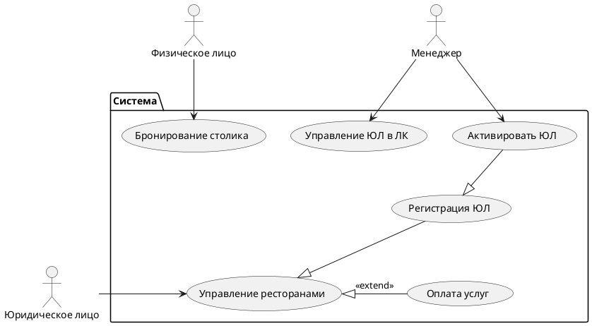
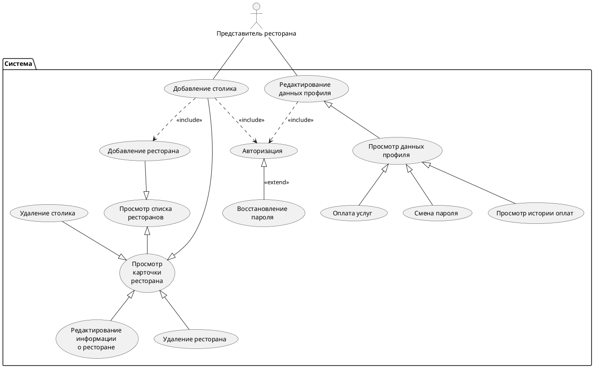
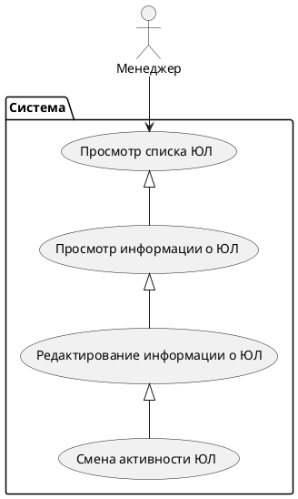
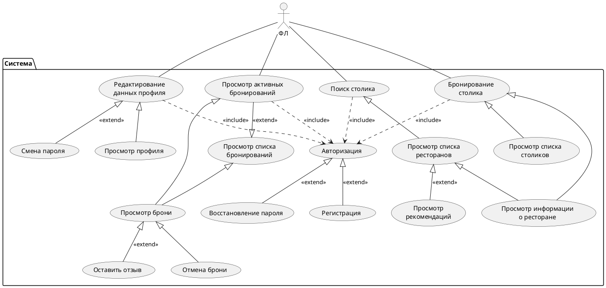
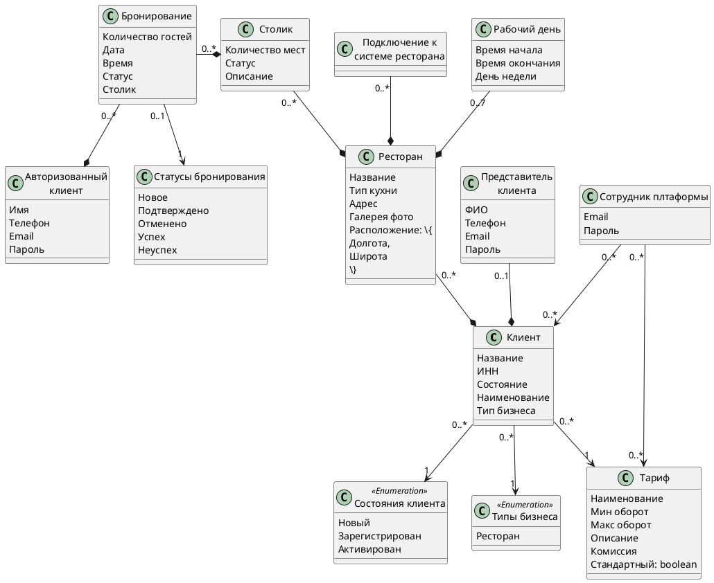

## Верхнеуровневая схема UC

## Детальное описание верхнеуровневых UC

### Управление ресторанами и оплата услуг

## Управление ЮЛ в ЛК

## Бронирование столика

## Модель предметной области

## Информационная модель

### Context

### Containers

| №П/П | Тип             | Наименование              | Технологии               | Описание                                               |
| ---- | --------------- | ------------------------- | ------------------------ | ------------------------------------------------------ |
| 1    | Software System | BookingSystem             | Java, Spring Boot        | Сервис, реализующий бизнес логику.                     |
| 2    | Container       | BookingWebApp             | React, JavaScript        | Веб-интерфейс для клиентов и сотрудников. SPA          |
| 3    | Container       | BookingAndroidApplication | Kotlin                   | Мобильное приложение для клиентов, Android.            |
| 4    | Container       | BookingIOSApplication     | Swift                    | Мобильное приложение для клиентов, iOS.                |
| 5    | Container       | Booking database          | PostgreSQL               | Основная БД проекта.                                   |
| 6    | Software System | 1C                        | Платформа 1С:Предприятие | Хранение клиентов, автоматизация учета                 |
| 7    | Software System | Wallet One                | REST API                 | Платежная система для реализации функционала оплаты    |
| 8    | Software System | Email Service             | SMTP                     | Отправка уведомлений клиентам                          |
| 9    | Software System | R-Keeper                  | REST API                 | Информация о столиках, расписание, бронирование        |
| 10   | Software System | Google Maps               | REST API                 | Просмотр ресторанов на карте в интерфейсе пользователя |
| 11   | Software System | Google Analitycs          | REST API                 | Формирование аналитики по посещениям                   |
| 12   | Software System | Контур.Фокус              | REST API                 | Проверка контрагентов-юридических лиц                  |
| 13   | Container       | Keycloak                  | Java, Oauth2             | Сервис авторизации и аутотентификации                  |
